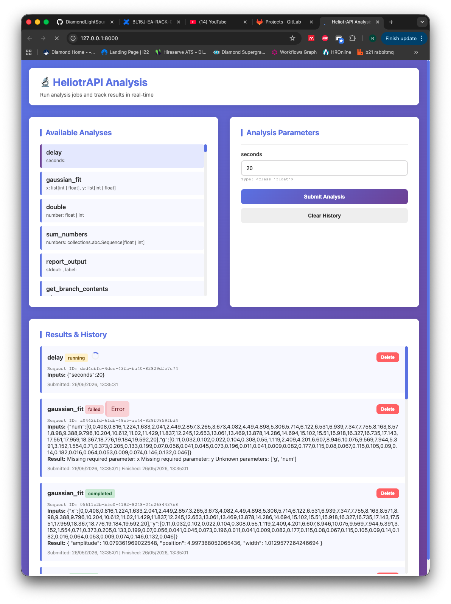

[](https://github.com/DiamondLightSource/heliotrapi/actions/workflows/ci.yml)
[](https://codecov.io/gh/DiamondLightSource/heliotrapi)
[](https://pypi.org/project/heliotrapi)
[](https://www.apache.org/licenses/LICENSE-2.0)

# heliotrapi

An API for small fast data analysis jobs at Diamond Light Source.

`heliotrapi` exposes an HTTP API to submit analysis jobs, return queued results, and optionally consume messages from RabbitMQ.

Source          | <https://github.com/DiamondLightSource/heliotrapi>
:---:           | :---:
PyPI            | `pip install heliotrapi`
Docker          | `docker run ghcr.io/diamondlightsource/heliotrapi:latest`
Releases        | <https://github.com/DiamondLightSource/heliotrapi/releases>

Example Python usage:

```python
from heliotrapi import __version__

print(f"Hello heliotrapi {__version__}")
```

To start the api server in dev mode on local host:

```bash
uvicorn heliotrapi.main:start_api --reload --factory --host 127.0.0.1 --port 8000

or

heliotrapi serve

```

## Overview

The app accepts analysis jobs via HTTP or the client and stores results in memory for a configurable time-to-live. Jobs can also be ingested from RabbitMQ if `rabbitmq.enabled` is set.

## Sending/Recieving results using the python client

```python

    from heliotrapi.client import AnalysisClient

    client = AnalysisClient("ixx-analysis.diamond.ac.uk")

    print(client.available_analyses()) #see available analyses

    client.submit("name_of_analysis", x=x, y=y)

    result = client.get_result() #returns an AnalysisResult basemodel

    print(result)

```

## Using the WebUI

You can also navigate to the url or the ip address to be met with:



### Request flow

- AnalysisClient submits jobs to `/analyse`
- Jobs are queued in `QueueManager`
- Workers process jobs in FIFO order
- Results are returned via `/result/id/{request_id}` or `/result/latest`
- Optional RabbitMQ listener can enqueue jobs automatically

                     AnalysisClient ─────--────────────────
                        │ ▲                │              │
                        ▼ │                ▼              ▼
        Analysis <-── heliotrapi ──---►  RabbitMQ ──---► Results
           Job   ─---►    ▲                │
                          │                │
                          │                │   
                    RabbitListener <───────


## Kubernetes deployment

This repository includes a Helm chart under `./helm/helm/heliotrapi`.

### Config support

The service supports configuration from one of these sources:

- `CONFIG_PATH` environment variable
- mounted config file at `/etc/config/config.yaml`
- local `config.yaml` file in the current working directory

In Kubernetes, the Helm chart mounts `config.yaml` from a `ConfigMap` and sets:

```yaml
env:
  - name: CONFIG_PATH
    value: "/etc/config/config.yaml"
```

### RabbitMQ config

The Helm values now expose RabbitMQ settings in the same shape as the app expects:

```yaml
config:
  rabbitmq:
    enabled: true
    host: ixx-analysis.diamond.ac.uk
    username: guest
    password: guest
    port: 61613
    destinations:
      - "/topic/public.worker.event"
      - "/topic/gda.messages.scan"
      - "/topic/gda.messages.processing"
      - "/topic/public.analysis.trigger"
```

## Helm usage

1. Build and push your Docker image

```bash
podman build -t ghcr.io/diamondlightsource/heliotrapi:latest .
podman push ghcr.io/diamondlightsource/heliotrapi:latest
```

2. Render the chart

```bash
helm template heliotrapi ./helm/helm/heliotrapi
```

3. Dry-run validation

```bash
helm template heliotrapi ./helm/helm/heliotrapi | kubectl apply --dry-run=client -f -
```

4. Install the chart

```bash
helm install heliotrapi ./helm/helm/heliotrapi
```

5. Verify the deployment

```bash
kubectl get pods
kubectl get svc
```

6. Test the API

```bash
kubectl port-forward svc/heliotrapi 8000:8000
```

Then open:

```text
http://localhost:8000/docs
```

## Notes

- The chart name has been updated to `heliotrapi`.
- The config file is mounted via a `ConfigMap` and loaded from `/etc/config/config.yaml`.
- The Helm chart currently creates a `Deployment`, `Service`, and `ConfigMap`.
